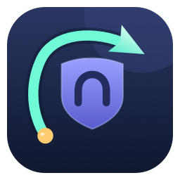

# Direct Sites



Нативное приложение для macOS, которое направляет выбранные сайты в обход VPN. Добавь основной домен — например, `example.com` — и Firefox или Google Chrome смогут подключаться напрямую ко всем его поддоменам. Для других приложений доступен режим исключений по IP.

Приложение написано на Swift/AppKit без сторонних библиотек. Интерфейс доступен на русском и английском. Список сохраняется, фоновые службы продолжают работу после закрытия окна.

[Скачать релиз](https://github.com/hardcodd/direct-sites/releases/latest) · [История изменений](CHANGELOG.md) · [Спецификация](SPECS.md) · [MIT License](LICENSE)

## Требования и установка

- Mac с Apple Silicon. Сборка нацелена на macOS 14+, фактически проверена на macOS 27; Intel и более ранние версии macOS не проверялись.
- Права администратора для установки, изменения списка и удаления служб.
- Firefox или Google Chrome для режима домена со всеми поддоменами.
- VPN должен разрешать соединения через физический сетевой интерфейс. Жёсткий Kill Switch может их блокировать.

Скачай `Direct-Sites-v0.3.0-macOS-arm64.zip` из релиза, распакуй и перенеси **Direct Sites.app** в **Applications / Программы**. Архив содержит локальную ad-hoc подпись, но не Developer ID и не нотариализацию Apple. Поэтому macOS может заблокировать первый запуск скачанного приложения. Если доверяешь исходникам и происхождению архива, используй предусмотренное macOS разрешение открытия в настройках конфиденциальности и безопасности либо собери приложение самостоятельно.

Первый запуск окна не устанавливает службы. Установка происходит при нажатии **Apply / Применить** с системным запросом администратора. Приложение не получает и не сохраняет пароль.

## Браузеры: основной домен и все поддомены

1. Нажми **Add site / Добавить сайт**, введи домен и удобное название.
2. Оставь включённой опцию **Domain and all subdomains — browser mode / Домен и все поддомены — режим браузера**.
3. Нажми **Apply / Применить** и подтверди системный запрос.

### Firefox

1. Нажми **Set up Firefox… / Настройка Firefox…**, чтобы скопировать адрес PAC.
2. В настройках Firefox найди `proxy` или «прокси» и открой настройки соединения. Сохрани прежний режим, затем выбери **Automatic proxy configuration URL / URL автоматической настройки прокси** и вставь:

   ```text
   http://127.0.0.1:17879/proxy.pac
   ```

3. Firefox должен передавать доменные имена через SOCKS5. Если доступна настройка **Proxy DNS when using SOCKS v5**, включи её. В некоторых версиях Firefox она скрыта в режиме PAC.

### Google Chrome

1. Нажми **Set up Chrome… / Настройка Chrome…**. Приложение скопирует расширение в папку поддержки текущего пользователя и скопирует путь к ней в буфер обмена.
2. Открой страницу расширений из появившегося окна. В Chrome включи **Developer mode / Режим разработчика** и нажми **Load unpacked / Загрузить распакованное расширение**.
3. В окне выбора папки нажми **Command-Shift-G**, вставь скопированный путь и выбери папку. Chrome попросит разрешить расширению управлять его прокси-настройками.
4. Убедись, что расширение **Direct Sites for Chrome** включено. Устанавливай его отдельно в каждом профиле Chrome, где нужен обход VPN. После обновления приложения снова нажми **Настройка Chrome**, чтобы скопировать новые файлы, затем **Reload / Обновить** на карточке расширения.

Расширение задаёт локальный PAC только для выбранного профиля Chrome. Системные настройки прокси macOS оно не меняет. Если расширение или локальная служба отключены, доступ браузера к сайтам может нарушиться; перед удалением службы отключи расширение.

Открой нужный сайт в настроенном браузере. Выбери правило в Direct Sites: в подробностях появятся имена, для которых успешно установлено прямое соединение.

Например, правило `beget.com` охватывает `cp.beget.com`, `api-cp.beget.com` и другие поддомены. Домены сторонней авторизации или другого сервиса нужно добавить отдельно. Правило `example.com` не охватывает `example.com.other.org`.

Через локальную службу проходит весь трафик настроенного браузера, который использует эту прокси-настройку. Совпавшие адреса подключаются через Ethernet/Wi-Fi, остальные используют обычную системную маршрутизацию, в том числе VPN. Локальные `localhost`, `127.*` и `::1` исключены из PAC.

Поддерживаются TCP-соединения, включая HTTPS и WebSocket. SOCKS UDP/QUIC не поддерживается. TLS передаётся без расшифровки, сертификаты не устанавливаются. DNS использует системные настройки; приложение не гарантирует обход VPN для DNS-запросов.

**Перед остановкой или удалением службы верни прежний режим прокси Firefox и отключи расширение Chrome.** Иначе браузеры останутся настроены на недоступный прокси. Закрывать окно Direct Sites можно: службы работают независимо от него.

## Исключения по IP для всех приложений

Добавь IP или точный домен и отключи опцию всех поддоменов. IP-адрес всегда использует режим маршрутов. Служба разрешает домен в IPv4/IPv6 и создаёт отдельные маршруты через физический шлюз, не изменяя системный маршрут по умолчанию.

Исключение действует на IP целиком, включая другие сайты на этом адресе. Поддомены автоматически не охватываются; для браузера удобнее доменный режим. CDN может возвращать разные IP браузеру и службе, поэтому режим маршрутов подходит не для каждого сайта.

Служба сверяет маршруты каждые 30 секунд. Ошибка DNS сохраняет ранее найденные адреса. После смены сети или переподключения VPN восстановление происходит на следующем успешном проходе; длительные операции могут увеличить задержку. Отсутствие прямого IPv6-шлюза отображается как предупреждение.

Существующие ручные маршруты считаются внешними: приложение их не присваивает и не удаляет. Удаление записи снимает только маршруты, созданные службой и всё ещё совпадающие с её данными. Общий IP остаётся, пока он нужен другой записи.

## Список сайтов и состояние

Принимаются домены, HTTP(S) URL и IP. Из URL используется только хост. Название можно отредактировать; пустое название заменяется доменом. Приложение ищет фавиконку в HTML главной страницы сайта и затем по адресу `/favicon.ico`. Для браузерных правил запросы проходят через локальный прокси Direct Sites. Удачно загруженная иконка сохраняется в локальном кэше: она видна при временной недоступности сайта, а обновление проверяется при следующем запуске приложения. Неудачные запросы повторяются с увеличивающейся задержкой, пока окно открыто. Если доступную иконку получить не удалось, отображается стандартный значок. Для IP-адресов иконки не загружаются. Название страницы автоматически не извлекается.

Все изменения вступают в силу после **Apply / Применить**. Применение перезапускает прокси и может прервать текущие соединения. Статус «Напрямую» подтверждает маршрут, а «Готово для браузеров» — доступность локальной службы; это не гарантирует загрузку сайта или успешный вход.

## Фоновые службы и данные

| Компонент | Назначение |
| --- | --- |
| `app.directsites` | Root-служба для проверки и изменения IP-маршрутов |
| `app.directsites.browser` | SOCKS5-прокси от пользователя `nobody` |
| `/Library/Application Support/DirectSites/` | Копия helper, `rules.json`, `state.json` и блокировка |
| `/Library/LaunchDaemons/` | Два задания launchd |
| `127.0.0.1:17879` | SOCKS5, `/proxy.pac` и `/status` |

Службы настроены на автоматический запуск после загрузки macOS. Восстановление после реальной перезагрузки пока не проверено. Перемещение или удаление самого `.app` не удаляет установленную копию helper. При применении новой версии приложение заменяет задания прежней версии после проверки их путей и команд, сохраняя список и данные о принадлежащих службе маршрутах.

Список и состояние доступны для чтения локальным пользователям; изменять их может администратор. Прокси слушает только loopback, но доступен другим процессам и пользователям этого Mac без аутентификации. Это не средство изоляции локальных аккаунтов. `/status` хранит в памяти счётчики соединений и до 100 совпавших имён; URL-пути и пароли не сохраняются.

## Удаление

1. Восстанови прежние настройки прокси Firefox и отключи расширение Direct Sites в Chrome.
2. В Direct Sites нажми **Remove service… / Удалить службу…** и подтверди удаление.
3. После успешного завершения удали приложение из «Программ».

Удаляются обе службы, сохранённый список и управляемые маршруты. Внешние маршруты сохраняются. При ошибке очистки повтори удаление; пустой каталог с файлом блокировки может остаться.

## Сборка из исходников

Нужны macOS, Apple Command Line Tools со Swift 6, `iconutil`, `codesign` и [RTK](https://github.com/rtk-ai/rtk). Проверенная среда: Swift 6.4 и macOS SDK 27.0. RTK используется только сценарием сборки и не требуется пользователям готового приложения.

```sh
rtk zsh build.sh
```

Сценарий запускает тесты, собирает arm64 GUI и helper с предупреждениями как ошибками, генерирует иконку, подписывает пакет и проверяет подпись. Результат: `Direct Sites.app` и `Direct Sites.zip` в корне проекта; промежуточные файлы находятся в `$TMPDIR/DirectSitesBuild`. Запускай сборку в обычном локальном окружении: ограничения песочницы могут мешать `iconutil`.

Для проверки архива распакуй его в локальный временный каталог и выполни `codesign --verify --deep --strict` для `.app`. Облачные каталоги могут добавлять расширенные атрибуты, влияющие на проверку подписи.

| Исходник | Содержание |
| --- | --- |
| `Source/App.swift` | Окно, редактирование правил, авторизация и favicon |
| `Source/ChromeSetup.swift`, `ChromeExtension/` | Подготовка и исходники расширения Chrome |
| `Source/Core.swift` | Модели, проверка ввода, шлюзы и хранение |
| `Source/Helper.swift` | Установка, сверка маршрутов и удаление |
| `Source/Migration.swift` | Определение установленных служб прежней версии |
| `Source/BrowserProxy.swift` | SOCKS5, TCP relay и локальные HTTP endpoints |
| `Source/ProxyRouting.swift` | PAC, сопоставление доменов и статистика |
| `Source/Tests.swift` | Проверки контрактов ядра |
| `Source/Icon.swift` | Генерация иконки средствами AppKit |

Тесты проверяют нормализацию, некорректный ввод, выбор шлюза, общие IP, сохранение DNS-кэша, защиту чужих маршрутов, границы доменных правил, чтение старой конфигурации, определение прежних служб и установку файлов расширения в пользовательский каталог. Они не заменяют проверку root-службы, Chrome, IPv6, перезагрузки, смены сети и совместимости с конкретным VPN.

## Лицензия

MIT. Условия находятся в [LICENSE](LICENSE).
